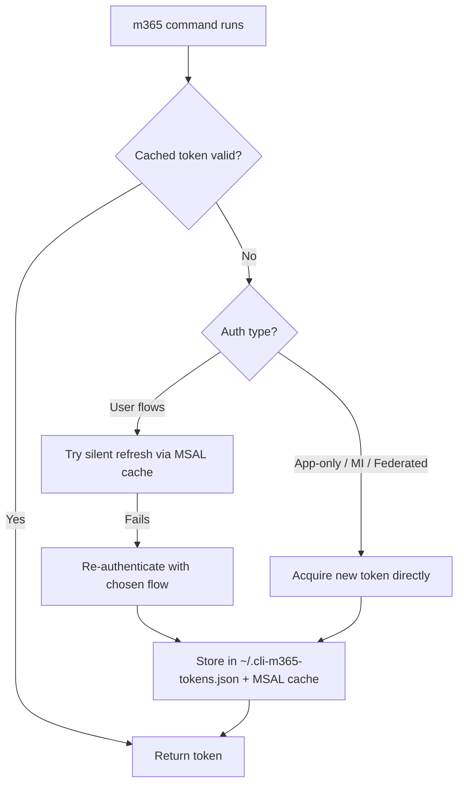

## User

Explain authentication methods for m365

## Assistant

I'll look through the repo for M365 authentication docs and code so the explanation matches how this project handles it.


## Tools

- Search: **/*.{md,ts,js,py,go,rs}
- Search: auth|token|OAuth|MSAL|certificate|client.?secret
- Read: /Users/sp/.grok/worktrees/git-cli-microsoft365/2026-06-28-3b0a815e/src/Auth.ts (1-150)
- Read: /Users/sp/.grok/worktrees/git-cli-microsoft365/2026-06-28-3b0a815e/README.md (91-180)
- Search: AuthType|login|authType
- Read: /Users/sp/.grok/worktrees/git-cli-microsoft365/2026-06-28-3b0a815e/src/m365/commands/login.ts (1-120)
- Read: /Users/sp/.grok/worktrees/git-cli-microsoft365/2026-06-28-3b0a815e/src/Auth.ts (221-420)
- Search: ensureAccessTokenWith|Browser|FederatedIdentity|Identity
- Read: /Users/sp/.grok/worktrees/git-cli-microsoft365/2026-06-28-3b0a815e/src/Auth.ts (441-760)
- Search: browser|authType
- Read: /Users/sp/.grok/worktrees/git-cli-microsoft365/2026-06-28-3b0a815e/src/Auth.ts (831-880)
- Search: json.*token|token.*json

## Assistant

Microsoft 365 authentication is built on **Microsoft Entra ID** (formerly Azure AD) and the **OAuth 2.0 / OpenID Connect** protocols. Every API call — Graph, SharePoint, Teams, Power Platform — needs an **access token** issued for a specific **resource** (audience) and **scope** (permission).

In this repo (CLI for Microsoft 365), all of that is handled through **MSAL Node** (`@azure/msal-node`) and the `m365 login` command. The supported methods are defined in `AuthType`:

```103:111:src/Auth.ts
export enum AuthType {
  DeviceCode = 'deviceCode',
  Password = 'password',
  Certificate = 'certificate',
  Identity = 'identity',
  FederatedIdentity = 'federatedIdentity',
  Browser = 'browser',
  Secret = 'secret'
}
```

---

## Two fundamental patterns

| Pattern | Who signs in | Typical use |
|---------|--------------|-------------|
| **Delegated** | A user | Interactive tools, acting on behalf of a person |
| **Application (app-only)** | The app itself | Automation, CI/CD, background jobs |

Delegated flows use a **public client** (no secret stored in the app). App-only flows use a **confidential client** (certificate or client secret proves the app's identity).

---

## Authentication methods

### 1. Device Code (default)

**What it is:** The CLI shows a URL and a one-time code. You open a browser on any device, enter the code, and sign in with your M365 account.

**When to use:** Local development, servers without a browser, SSH sessions.

**How it works here:** MSAL's `acquireTokenByDeviceCode` — see `ensureAccessTokenWithDeviceCode`.

```sh
m365 login
# or explicitly:
m365 login --authType deviceCode
```

After the first login, tokens are cached and refreshed silently when possible.

---

### 2. Browser (interactive)

**What it is:** Opens a local web server, launches your default browser, and completes the standard authorization-code flow.

**When to use:** Desktop machines where a browser popup is acceptable — often smoother than device code.

**How it works here:** `AuthServer` captures the redirect, then MSAL exchanges the code via `acquireTokenByCode`.

```sh
m365 login --authType browser
```

---

### 3. Username and Password (ROPC)

**What it is:** The app sends username + password directly to Entra ID (Resource Owner Password Credentials flow).

**When to use:** Legacy automation only. Microsoft **discourages** this flow; it does not support MFA, conditional access is limited, and many tenants block it.

```sh
m365 login --authType password --userName user@contoso.com --password '...'
```

Uses MSAL `acquireTokenByUsernamePassword` with a public client.

---

### 4. Certificate (app-only)

**What it is:** The Entra app registration has an uploaded certificate. The CLI signs a JWT assertion with the private key to prove identity — no secret in config.

**When to use:** Production automation, CI/CD, anything long-running. **Preferred over client secrets** because the private key never leaves your environment and certs can be rotated.

**How it works here:** Confidential client + `acquireTokenByClientCredential`. Supports PEM or PFX (`.pfx`) certs, with optional thumbprint.

```sh
m365 login --authType certificate --appId <app-id> --tenant <tenant-id> \
  --certificateFile ./cert.pfx
```

---

### 5. Client Secret (app-only)

**What it is:** A shared secret configured on the Entra app registration. The CLI sends it with the token request.

**When to use:** Quick setup or environments where cert management is hard. Less secure than certificates (secret can leak, harder to rotate safely).

```sh
m365 login --authType secret --appId <app-id> --tenant <tenant-id> --secret <secret>
```

Uses the same client-credential flow as certificate auth.

---

### 6. Azure Managed Identity

**What it is:** When the CLI runs **inside Azure** (VM, App Service, Functions, Cloud Shell), Azure injects identity metadata. No credentials in code or config.

**When to use:** Scripts and pipelines running on Azure infrastructure.

**How it works here:** Calls the Azure Instance Metadata Service (IMDS) at `169.254.169.254`, or uses `IDENTITY_ENDPOINT` / `MSI_ENDPOINT` env vars. Supports system-assigned and user-assigned identities.

```sh
# System-assigned (on an Azure resource with MI enabled)
m365 login --authType identity

# User-assigned (pass client_id or object_id as userName)
m365 login --authType identity --userName <managed-identity-client-id>
```

---

### 7. Federated Identity (workload identity federation)

**What it is:** **Passwordless** app authentication from external CI systems. GitHub Actions or Azure DevOps obtains a short-lived OIDC token from the pipeline; that token is exchanged for an M365 access token via Entra's federated credential trust.

**When to use:** GitHub Actions and Azure DevOps pipelines — no secrets or certs stored in the repo.

**How it works here:** Detects `ACTIONS_ID_TOKEN_REQUEST_URL` (GitHub) or `SYSTEM_OIDCREQUESTURI` (Azure DevOps), fetches a federation token, then exchanges it.

```sh
m365 login --authType federatedIdentity --appId <app-id> --tenant <tenant-id>
```

In Azure DevOps with a service connection, `appId` and `tenant` can be inferred automatically.

---

## Prerequisites: Entra app registration

Most methods require a **Microsoft Entra app registration** with the right API permissions (e.g. Microsoft Graph, SharePoint). The CLI ships with a default app, but Microsoft recommends registering your own:

```sh
m365 setup
```

See the [using your own identity](https://pnp.github.io/cli-microsoft365/user-guide/using-own-identity/) guide.

| Auth type | App type needed |
|-----------|-----------------|
| Device code, Browser, Password | Public client (or custom app with redirect URIs) |
| Certificate, Secret | Confidential client + admin consent |
| Managed Identity | Azure resource with MI + Graph permissions granted to that identity |
| Federated Identity | App registration with federated credential (GitHub/ADO) |

---

## Token lifecycle in this CLI



- **Delegated flows** can refresh silently from the MSAL token cache (`~/.cli-m365-msal.json`).
- **App-only, managed identity, and federated** always fetch a fresh token — there is no user account to refresh against.

---

## Choosing the right method

| Scenario | Recommended method |
|----------|-------------------|
| Local dev on your laptop | Device code or Browser |
| GitHub Actions / Azure DevOps | Federated identity |
| Azure VM / App Service script | Managed identity |
| On-prem or non-Azure automation | Certificate |
| Quick prototype automation | Client secret (migrate to cert later) |
| Legacy script with no MFA | Password (avoid if possible) |

---

## Security notes

- **MFA and Conditional Access** work with interactive flows (device code, browser) but not with ROPC.
- **App-only tokens** carry application permissions — they are powerful; grant only what you need and use admin consent carefully.
- Token files on disk (`~/.cli-m365-tokens.json`, `~/.cli-m365-msal.json`) are **not encrypted** — treat the machine as trusted.

For full option reference, see the [login command docs](https://pnp.github.io/cli-microsoft365/cmd/login/). If you want, I can go deeper on any one method — e.g. setting up federated credentials for GitHub Actions, or certificate auth end-to-end.

## User

I'd like to implement new authentication methos - 'token'. It will require '--authType token' and '--tokenFile' argument, specifying token to use, skipping any interactive or non-interactive logons.

## Assistant

I'll explore how auth and login are wired today, then add a `token` auth type that reads credentials from `--tokenFile` and skips all login flows.


## Tools

- Read: /Users/sp/.grok/bundled/skills/implement/SKILL.md (1-80)
- Read: /Users/sp/.grok/worktrees/git-cli-microsoft365/2026-06-28-3b0a815e/src/m365/commands/login.ts
- Search: authType|AuthType
- Read: /Users/sp/.grok/worktrees/git-cli-microsoft365/2026-06-28-3b0a815e/src/utils/accessToken.ts
- Read: /Users/sp/.grok/worktrees/git-cli-microsoft365/2026-06-28-3b0a815e/src/Auth.ts (901-1043)
- Search: **/login.mdx
- Read: /Users/sp/.grok/worktrees/git-cli-microsoft365/2026-06-28-3b0a815e/src/m365/commands/login.spec.ts (1-100)
- Search: tokenFile|AuthType\.Token|authType.*token
- Read: /Users/sp/.grok/worktrees/git-cli-microsoft365/2026-06-28-3b0a815e/docs/docs/cmd/login.mdx (1-120)
- Read: /Users/sp/.grok/worktrees/git-cli-microsoft365/2026-06-28-3b0a815e/src/m365/commands/login.spec.ts (331-410)
- Read: /Users/sp/.grok/worktrees/git-cli-microsoft365/2026-06-28-3b0a815e/src/Auth.ts (181-220)
- Search: eyJ|access_token|expiresOn
- Read: /Users/sp/.grok/worktrees/git-cli-microsoft365/2026-06-28-3b0a815e/src/Auth.spec.ts (2-101)
- Search: getTelemetryProperties|authType
- Search: eyJ0eXAi|eyJhbGci
- Read: /Users/sp/.grok/worktrees/git-cli-microsoft365/2026-06-28-3b0a815e/src/utils/accessToken.spec.ts (1-80)
- Search: authType.*identity|federatedIdentity
- Search: deviceCode.*password.*certificate|AuthType\.|authType.*enum
- Read: /Users/sp/.grok/worktrees/git-cli-microsoft365/2026-06-28-3b0a815e/src/settingsNames.ts
- Search: certificate.*deviceCode|authType.*allowed|federatedIdentity
- Search: getTelemetryProperties
- Search: authType
- Search: authType

## Assistant

Implementing the `token` auth type: reading credentials from `--tokenFile` and bypassing all MSAL login flows.


## Tools

- Read: /Users/sp/.grok/worktrees/git-cli-microsoft365/2026-06-28-3b0a815e/src/Auth.ts (48-102)
- Edit: /Users/sp/.grok/worktrees/git-cli-microsoft365/2026-06-28-3b0a815e/src/utils/accessToken.ts
- Edit: /Users/sp/.grok/worktrees/git-cli-microsoft365/2026-06-28-3b0a815e/src/utils/accessToken.ts
- Edit: /Users/sp/.grok/worktrees/git-cli-microsoft365/2026-06-28-3b0a815e/src/Auth.ts
- Edit: /Users/sp/.grok/worktrees/git-cli-microsoft365/2026-06-28-3b0a815e/src/Auth.ts
- Edit: /Users/sp/.grok/worktrees/git-cli-microsoft365/2026-06-28-3b0a815e/src/Auth.ts
- Edit: /Users/sp/.grok/worktrees/git-cli-microsoft365/2026-06-28-3b0a815e/src/Auth.ts
- Edit: /Users/sp/.grok/worktrees/git-cli-microsoft365/2026-06-28-3b0a815e/src/Auth.ts
- Edit: /Users/sp/.grok/worktrees/git-cli-microsoft365/2026-06-28-3b0a815e/src/Auth.ts
- Read: /Users/sp/.grok/worktrees/git-cli-microsoft365/2026-06-28-3b0a815e/src/Auth.ts (226-280)
- Edit: /Users/sp/.grok/worktrees/git-cli-microsoft365/2026-06-28-3b0a815e/src/m365/commands/login.ts
- Edit: /Users/sp/.grok/worktrees/git-cli-microsoft365/2026-06-28-3b0a815e/src/m365/commands/login.ts
- Edit: /Users/sp/.grok/worktrees/git-cli-microsoft365/2026-06-28-3b0a815e/src/m365/commands/login.ts
- Edit: /Users/sp/.grok/worktrees/git-cli-microsoft365/2026-06-28-3b0a815e/src/m365/commands/login.ts
- Edit: /Users/sp/.grok/worktrees/git-cli-microsoft365/2026-06-28-3b0a815e/src/m365/commands/login.ts

## Assistant

Adding tests for the token auth flow.


## Tools

- Read: /Users/sp/.grok/worktrees/git-cli-microsoft365/2026-06-28-3b0a815e/src/m365/commands/login.spec.ts (401-480)
- Read: /Users/sp/.grok/worktrees/git-cli-microsoft365/2026-06-28-3b0a815e/src/Auth.spec.ts (1281-1360)
- Read: /Users/sp/.grok/worktrees/git-cli-microsoft365/2026-06-28-3b0a815e/src/utils/accessToken.spec.ts (181-202)
- Search: AuthType\.Secret
- Read: /Users/sp/.grok/worktrees/git-cli-microsoft365/2026-06-28-3b0a815e/src/Auth.spec.ts (1896-1945)
- Edit: /Users/sp/.grok/worktrees/git-cli-microsoft365/2026-06-28-3b0a815e/src/utils/accessToken.spec.ts
- Edit: /Users/sp/.grok/worktrees/git-cli-microsoft365/2026-06-28-3b0a815e/src/utils/accessToken.spec.ts
- Edit: /Users/sp/.grok/worktrees/git-cli-microsoft365/2026-06-28-3b0a815e/src/m365/commands/login.spec.ts
- Edit: /Users/sp/.grok/worktrees/git-cli-microsoft365/2026-06-28-3b0a815e/src/m365/commands/login.spec.ts
- Edit: /Users/sp/.grok/worktrees/git-cli-microsoft365/2026-06-28-3b0a815e/src/Auth.spec.ts
- Edit: /Users/sp/.grok/worktrees/git-cli-microsoft365/2026-06-28-3b0a815e/src/utils/accessToken.ts
- Edit: /Users/sp/.grok/worktrees/git-cli-microsoft365/2026-06-28-3b0a815e/src/utils/accessToken.spec.ts
- Execute: cd /Users/sp/.grok/worktrees/git-cli-microsoft365/2026-06-28-3b0a815e && npm test -- --grep "token file|authType token|readAccessTokenFromFile|Token file" 2>&1 (Run token auth related tests)
- Execute: which node npm 2>/dev/null; ls /Users/sp/.grok/worktrees/git-cli-microsoft365/2026-06-28-3b0a815e/node_modules/.bin/mocha 2>/dev/null; type node 2>/dev/null (Find node and npm executables)
- Read: /Users/sp/.grok/worktrees/git-cli-microsoft365/2026-06-28-3b0a815e/package.json (1-40)
- Execute: export PATH="/usr/local/bin:/opt/homebrew/bin:$HOME/.nvm/versions/node/$(ls $HOME/.nvm/versions/node 2>/dev/null | tail -1)/bin:$PATH" && which npm node && cd /Users/sp/.grok/worktrees/git-cli-microsoft365/2026-06-28-3b0a815e && npm test -- --grep "token file|authType token|readAccessTokenFromFile|Token file" 2>&1 (Find npm via common paths and run tests)
- Execute: ls -la /usr/local/bin/node /opt/homebrew/bin/node ~/.fnm/current/bin/node 2>&1; find /Users/sp -maxdepth 4 -name npm -type f 2>/dev/null | head -5 (Search filesystem for node/npm binaries)
- Search: class CommandError
- Read: /Users/sp/.grok/worktrees/git-cli-microsoft365/2026-06-28-3b0a815e/src/m365/commands/login.spec.ts (67-81)

## Assistant

Implemented the `token` authentication method. Here's what was added:

## Usage

```sh
m365 login --authType token --tokenFile /path/to/token.json
```

No `appId`, MSAL flows, or interactive login — the CLI reads the access token directly from the file.

## Token file formats

**JSON** (primary):

```json
{
  "access_token": "eyJ..."
}
```

Also supports `accessToken`, and optional `expires_on` / `expiresOn`. If expiry is omitted, it's parsed from the JWT `exp` claim.

**Plain text** — the file can contain just the raw JWT string.

## Changes

1. **`Auth.ts`** — Added `AuthType.Token`, `connection.tokenFile`, and `ensureAccessTokenWithToken()` which reads from file (no MSAL). Token auth is excluded from silent refresh and MSAL cache handling, like certificate/secret auth.

2. **`login.ts`** — Added `--tokenFile` option with validation (required when `authType` is `token`, file must exist). No `appId` required for token auth.

3. **`accessToken.ts`** — Added `readAccessTokenFromFile()` to parse JSON or plain-text token files.

4. **Tests** — Coverage in `Auth.spec.ts`, `login.spec.ts`, and `accessToken.spec.ts`.

## Behavior

- On login, reads the token from `--tokenFile` and stores it in the connection.
- Uses the cached token while valid; re-reads the file when expired (so you can update the file externally).
- Persists `tokenFile` path in the connection store for session restore.

Node/npm wasn't available in this environment, so tests weren't run here. You can verify locally with:

```sh
npm run test:test -- --grep "token"
```

## User

Explain Grok worktrees. How do I merge the changes to git branch I opened?

## Assistant

I'll look up how Grok worktrees are documented and how changes get merged back to your branch.


## Tools

- Search: worktree
- Read: /Users/sp/.grok/skills/help/SKILL.md (1-51)
- Execute: cd /Users/sp/.grok/worktrees/git-cli-microsoft365/2026-06-28-3b0a815e && git status && git branch -vv && git remote -v && git log --oneline -3 2>&1 (Inspect git state in Grok worktree)
- Search: worktree
- Search: **/*
- Search: worktree
- Search: worktree
- Execute: cd /Users/sp/.grok/worktrees/git-cli-microsoft365/2026-06-28-3b0a815e && git worktree list 2>&1; ls -la /Users/sp/.grok/worktrees/git-cli-microsoft365/ 2>&1 (List git worktrees and Grok worktree dir)
- Read: /Users/sp/.grok/docs/user-guide/17-sessions.md (241-280)
- Read: /Users/sp/.grok/docs/user-guide/16-subagents.md (186-215)
- Execute: grok worktree --help 2>&1 || grok help worktree 2>&1 (Get grok worktree CLI help)
- Execute: grok worktree list 2>&1; grok worktree show 2026-06-28-3b0a815e 2>&1 (List and show current Grok worktree details)
- Read: /Users/sp/.grok/docs/user-guide/01-getting-started.md (161-200)
- Search: apply|merge.*worktree
- Execute: cd /Users/sp/git/cli-microsoft365 2>/dev/null && git branch -vv && git worktree list && git status --short 2>&1 || echo "Source repo not accessible" (Check source repo git state)
- Search: worktree|apply
- Execute: cd /Users/sp/.grok/worktrees/git-cli-microsoft365/2026-06-28-3b0a815e && git rev-parse --git-dir && cat .git 2>/dev/null; cd /Users/sp/git/cli-microsoft365 && git worktree list (Check if Grok worktree shares git dir with source)
- Read: /Users/sp/.grok/worktrees/git-cli-microsoft365/2026-06-28-3b0a815e/.git
- Execute: cd /Users/sp/git/cli-microsoft365 && git worktree list --porcelain 2>&1; ls -la /Users/sp/git/cli-microsoft365/.git/worktrees 2>&1 (List all linked git worktrees from main repo)
- Search: worktree|apply
- Search: standalone|apply|merge back

## Assistant

## What Grok worktrees are

When you start Grok with `-w` / `--worktree`, fork a session into a worktree, or run a subagent with `isolation: worktree`, Grok creates an **isolated copy** of your repo so agent edits don't touch your main checkout.

Your current session is in one of these:

| Property | Value |
|----------|-------|
| Path | `~/.grok/worktrees/git-cli-microsoft365/2026-06-28-3b0a815e` |
| Type | `fork` (session fork) |
| Source repo | `/Users/sp/git/cli-microsoft365` |
| Branch | `add-json-token` |
| Mode | `standalone` (separate clone, not a linked git worktree) |

The worktree started from the same commit as your main repo, but it's a **separate git checkout**. Changes here do **not** automatically appear in `/Users/sp/git/cli-microsoft365`.

Grok tracks worktrees under `~/.grok/worktrees/`. Useful commands:

```sh
grok worktree list          # list tracked worktrees
grok worktree show <label>  # details (path, branch, session, disk usage)
grok worktree rm <id>       # remove when done
grok worktree gc            # clean up stale/orphaned worktrees
```

---

## How to get changes onto your branch

Because this is a standalone clone, you merge via normal git — commit in the worktree, then bring those commits to your main checkout.

### Option 1: Commit + push + pull (recommended)

**In the Grok worktree** (where your changes are now):

```sh
cd ~/.grok/worktrees/git-cli-microsoft365/2026-06-28-3b0a815e

git add src/Auth.ts src/Auth.spec.ts src/m365/commands/login.ts \
        src/m365/commands/login.spec.ts src/utils/accessToken.ts \
        src/utils/accessToken.spec.ts

git commit -m "Add token authentication method"

git push -u origin add-json-token
```

**In your main repo**:

```sh
cd ~/git/cli-microsoft365
git pull origin add-json-token
```

Both checkouts are on `add-json-token`; after the pull, your main repo has the same commits.

---

### Option 2: Commit in worktree, cherry-pick in main repo

If you don't want to push yet:

```sh
# In the worktree — commit first
cd ~/.grok/worktrees/git-cli-microsoft365/2026-06-28-3b0a815e
git add -A && git commit -m "Add token authentication method"
git log -1 --oneline   # note the commit hash, e.g. abc1234

# In your main repo — cherry-pick that commit
cd ~/git/cli-microsoft365
git cherry-pick abc1234
```

---

### Option 3: Patch without committing (quick one-off)

```sh
cd ~/.grok/worktrees/git-cli-microsoft365/2026-06-28-3b0a815e
git diff > /tmp/token-auth.patch

cd ~/git/cli-microsoft365
git apply /tmp/token-auth.patch
git add -A && git commit -m "Add token authentication method"
```

---

## After merging

1. Open a PR from `add-json-token` as usual.
2. When you're done with the Grok worktree: `grok worktree rm 2026-06-28-3b0a815e` (or `grok worktree gc`).

---

## Important distinction

| Type | What it is | How changes sync |
|------|------------|------------------|
| **Grok standalone worktree** (yours) | Separate clone under `~/.grok/worktrees/` | Commit + push/pull, cherry-pick, or patch |
| **Git linked worktree** (`git worktree add`) | Shares `.git` with main repo | Commit on the branch — visible everywhere that branch is checked out |

Your setup is the first kind. The docs mention an internal "apply" operation for some subagent flows, but for a fork worktree like this, **standard git is the reliable path**.

If you want, I can commit and push the token-auth changes from this worktree for you.

## User

Can you save the session (prompts, responses) to a file in the worktree?

## Assistant

I'll check how Grok stores sessions and whether there's a way to export this conversation into the worktree.


## Tools

- Search: export|save.*session|session.*file|updates\.jsonl
- Read: /Users/sp/.grok/active_sessions.json
- Search: sessions (export|save|dump)
- Read: /Users/sp/.grok/docs/user-guide/04-slash-commands.md (89-118)
- Execute: grok sessions list 2>&1 | head -20; find /Users/sp/.grok/sessions -name "summary.json" -newer /Users/sp/.grok/active_sessions.json 2>/dev/null | head -5; grok --help 2>&1 | rg -i "export|session" | head -20 (Find current session and export commands)
- Search: **/019f0c05-b48f-70b1-9865-1fee2909c29b/**
- Search: export
- Execute: grok sessions --help 2>&1; grok help export 2>&1 (Check grok sessions and export CLI help)

## Assistant

Found `grok export` — exporting this session to a Markdown file in the worktree.


## Tools

- Execute: grok export 019f0c05-b48f-70b1-9865-1fee2909c29b /Users/sp/.grok/worktrees/git-cli-microsoft365/2026-06-28-3b0a815e/session-transcript.md 2>&1 && wc -l /Users/sp/.grok/worktrees/git-cli-microsoft365/2026-06-28-3b0a815e/session-transcript.md && head -30 /Users/sp/.grok/worktrees/git-cli-microsoft365/2026-06-28-3b0a815e/session-transcript.md (Export session transcript to worktree markdown file)